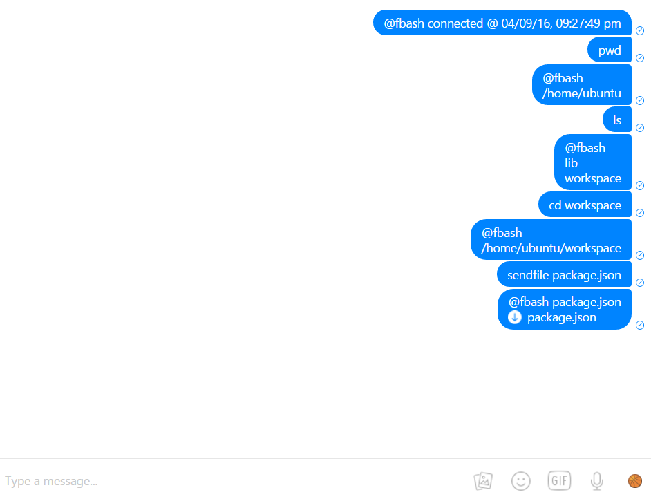

# fbash
Terminal over Facebook Messenger, running continuously as a background process.


[](https://nodei.co/npm/fbash/)



## Installation and Setup

Install through npm.
```shell
npm install -g fbash
```


## Running 

fbash can be started using the command `fbash`. When it is initially run, it will prompt the user for an email and password.

These should be the same credentials used to log into Facebook. In subsequent runs, fbash will use a saved app state to log in.
```shell
$ fbash
email: hello@example.com
password: ****************
Started fbash.
```

In addition, all running fbash processes can be stopped with the following command.
```shell
$ fbash-stop
```

## Usage

After starting the script on your computer, you can access your terminal by messaging a command to *yourself* on Facebook. You can use most terminal commands through fbash. 
It will respond with `@fbash` followed by the standard output, standard error, or other errors. 
fbash does *not* allow using commands which require user interaction, such as `vim`.

#### Additional commands
* sendfile &lt;filename&gt; - retrieves &lt;filename&gt; and sends as an attachment.

**Note: fbash is not a truly stateful terminal; it cannot handle environment variables and other functionality associated with terminal state. The working directory is handled manually by parsing `cd` commands. Because of this, compound commands with a `cd` component will not function properly, and may cause unexpected errors.**

## Fixes as of latest version
* No longer requires `sudo` to run.
* Previously fbash did not work when installed on non-Windows computers, due to issues with line ending format. This has been fixed
* Handled errors for calling fbash-stop when there are no fbash processes running
